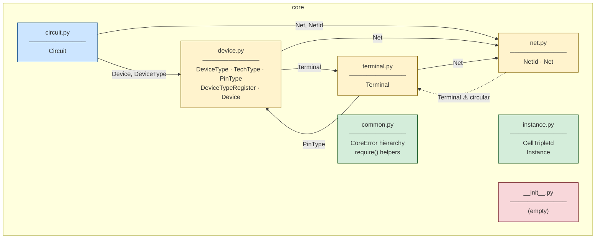
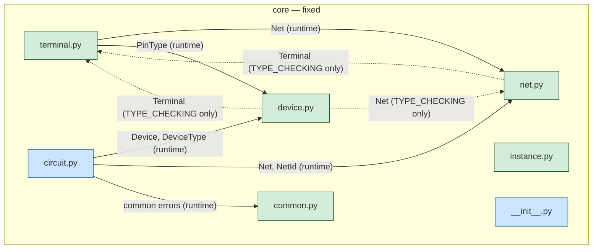

# core — Module Dependency Flowchart

## Dependency Graph (current state)



## Legend

| Arrow Style | Meaning |
|---|---|
| **Solid →** | Runtime `import` (e.g. `from core.net import Net`) |
| **Dashed ⚠ →** | Circular dependency — will fail at import time |
| **No arrows** | Module has zero imports from sibling core files |

| Node Colour | Meaning |
|---|---|
| 🟢 Green | Leaf module — no core dependencies |
| 🟡 Yellow | Mid-level — participates in circular import cycle |
| 🔵 Blue | Top-level consumer — imports others, nothing imports it |
| 🔴 Red | Empty / needs implementation |

---

## Current Import Map (per file)

| File | Imports from core | Exports (public API) |
|---|---|---|
| `common.py` | *(none)* | `CoreError`, `DuplicateDeviceError`, `DuplicateNetError`, `UnknownDeviceError`, `UnknownNetError`, `InvalidPinError`, `ValidationError`, `require()`, `require_non_empty()` |
| `instance.py` | *(none)* | `CellTripleId`, `Instance` |
| `net.py` | `terminal.Terminal` ⚠ | `NetId`, `Net` |
| `device.py` | `terminal.Terminal` ⚠, `net.Net` ⚠ | `DeviceType`, `TechType`, `PinType`, `PinTypeInfo`, `DeviceTypeRegister`, `Device` |
| `terminal.py` | `net.Net`, `device.PinType` | `Terminal` |
| `circuit.py` | `device.Device`, `device.DeviceType`, `net.Net`, `net.NetId` | `Circuit` |
| `__init__.py` | *(empty)* | *(nothing re-exported)* |

> ⚠ = part of a circular import chain that will raise `ImportError`.

---

## Circular Dependencies (problems)

### Cycle 1: `net.py` ↔ `terminal.py`

```
net.py  ──imports──▸  terminal.Terminal
terminal.py  ──imports──▸  net.Net
```

`net.py` only uses `Terminal` for its type annotation on `_terminals: list[Terminal]`.
It does **not** call any `Terminal` method at runtime.

### Cycle 2: `device.py` ↔ `terminal.py`

```
device.py  ──imports──▸  terminal.Terminal
terminal.py  ──imports──▸  device.PinType
```

`device.py` uses `Terminal` for type hints and as a dict value type.
`terminal.py` uses `PinType` both as a type hint **and** at runtime (stored on `self.pin_type`).

---

## Target State (after fixes)

Once the `TYPE_CHECKING` pattern is applied to break cycles, the clean
import DAG looks like this:



### Fixed import rules

| File | Runtime imports | `TYPE_CHECKING`-only imports |
|---|---|---|
| `common.py` | *(none)* | *(none)* |
| `instance.py` | *(none)* | *(none)* |
| `net.py` | *(none from core)* | `Terminal` |
| `device.py` | *(none from core)* | `Terminal`, `Net` |
| `terminal.py` | `.net.Net`, `.device.PinType` | `Device` |
| `circuit.py` | `.device.Device`, `.device.DeviceType`, `.net.Net`, `.net.NetId`, `.common.*` | *(none)* |
| `__init__.py` | Re-exports all public symbols | *(none)* |

### Pattern to apply

Every file that needs type-only imports should use:

```python
from __future__ import annotations
from typing import TYPE_CHECKING

if TYPE_CHECKING:
    from .terminal import Terminal   # only used in annotations
```

`from __future__ import annotations` makes **all** annotations strings at
runtime, so Python never tries to resolve the `TYPE_CHECKING`-guarded
imports during normal execution.

---

## Implementation Order

Build and test bottom-up following this order:

```
1.  common.py       ← already done, no changes needed
2.  instance.py     ← already done, no changes needed
3.  net.py          ← fix imports (remove runtime Terminal import)
4.  device.py       ← fix imports (move Terminal & Net to TYPE_CHECKING)
5.  terminal.py     ← fix imports (use relative imports, add TYPE_CHECKING for Device)
6.  circuit.py      ← fix imports (relative), add validation with common.py errors
7.  __init__.py     ← add re-exports and __all__
```
